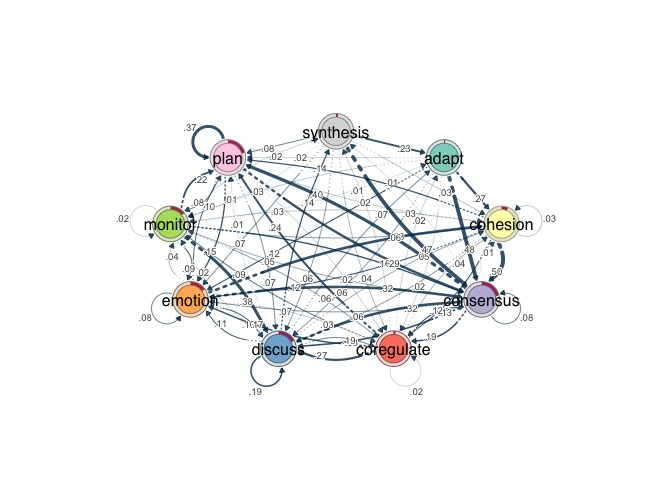
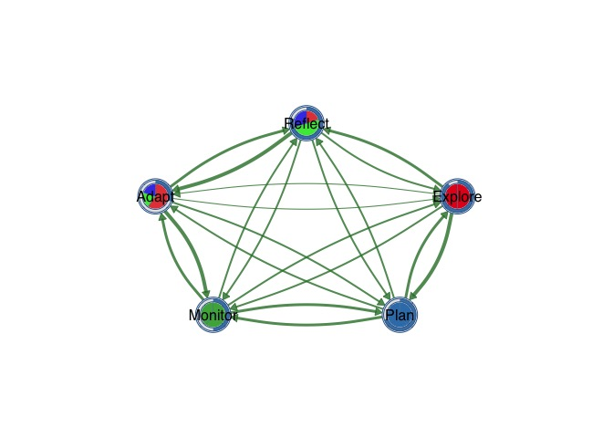
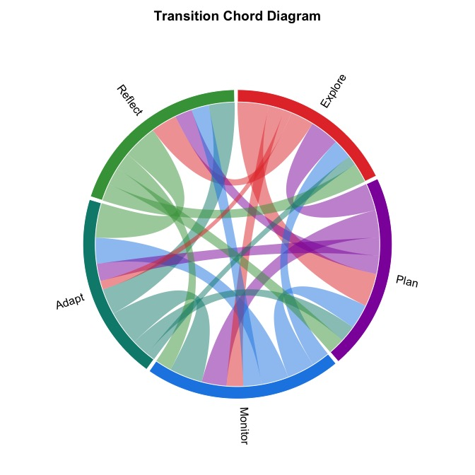
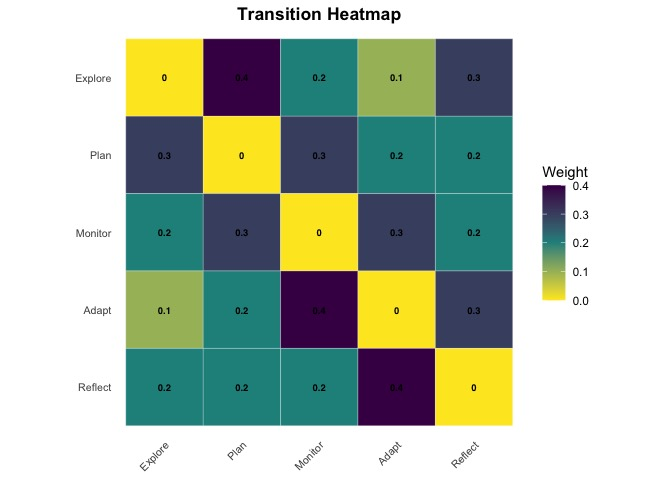

# cograph 

<!-- badges: start -->

[](https://www.repostatus.org/#active)
[](https://github.com/sonsoleslp/cograph/actions/workflows/R-CMD-check.yaml)
[](https://CRAN.R-project.org/package=cograph)
[](https://app.codecov.io/github/sonsoleslp/cograph?branch=main)
[](https://opensource.org/licenses/MIT)
<!-- badges: end -->

**cograph** is a modern R package for the analysis, visualization, and
manipulation of complex networks. It provides publication-ready plotting
with customizable layouts, node shapes, edge styles, and themes through
an intuitive, pipe-friendly API. It includes first-class support for
Transition Network Analysis (TNA), multilayer networks, and community
detection.

## Installation

``` r
# Install from CRAN
install.packages("cograph")

# Development version from GitHub
devtools::install_github("sonsoleslp/cograph")
```

## How to use it?

### Full tutorials

- [Network Visualization with
  `cograph`](https://sonsoles.me/cograph/articles/cograph-tutorial-plotting.html)
- [Visualization of communities and higher-order
  networks](https://sonsoles.me/cograph/articles/cograph-tutorial-communities.html)
- [Network Estimation and Visualization with `Nestimate` +
  cograph](https://sonsoles.me/cograph/articles/cograph-tutorial-nestimate.html)
- [Multi-Cluster Multi-Level Visualization with
  `plot_mcml`](https://sonsoles.me/cograph/articles/cograph-tutorial-mcml.html)
- [Higher-Order Network Analysis with Simplicial
  Complexes](https://sonsoles.me/cograph/articles/cograph-tutorial-simplicial.html)

### Quick guides

- [Why cograph?](https://sonsoles.me/cograph/articles/why-cograph.html)
- [Plotting TNA Models with
  `splot`](https://sonsoles.me/cograph/articles/plotting-tna-models.html)
- [Advanced
  examples](https://sonsoles.me/cograph/articles/mcml-examples.html)
- [Bootstrap Forest
  Plots](https://sonsoles.me/cograph/articles/bootstrap-forest.html)
- [Migrating from `qgraph` to
  `splot`](https://sonsoles.me/cograph/articles/qgraph-to-splot.html)

## Features

### Network Plotting

| Function               | Description                             |
|------------------------|-----------------------------------------|
| `splot()`              | Base R network plot (core engine)       |
| `soplot()`             | Grid/ggplot2 network rendering          |
| `tplot()`              | qgraph drop-in replacement for TNA      |
| `plot_htna()`          | Hierarchical multi-group TNA layouts    |
| `plot_mtna()`          | Multi-cluster TNA with shape containers |
| `plot_mcml()`          | Markov Chain Multi-Level visualization  |
| `plot_mlna()`          | Multilayer 3D perspective networks      |
| `plot_mixed_network()` | Combined symmetric/asymmetric edges     |

### Flow and Comparison Plots

| Function              | Description                            |
|-----------------------|----------------------------------------|
| `plot_transitions()`  | Alluvial/Sankey flow diagrams          |
| `plot_alluvial()`     | Alluvial wrapper with flow coloring    |
| `plot_trajectories()` | Individual tracking with line bundling |
| `plot_chord()`        | Chord diagrams with ticks              |
| `plot_heatmap()`      | Adjacency heatmaps with clustering     |
| `plot_compare()`      | Difference network visualization       |
| `plot_bootstrap()`    | Bootstrap CI result plots              |
| `plot_permutation()`  | Permutation test result plots          |

### Community and Higher-Order Structure

| Function | Description |
|----|----|
| `overlay_communities()` | Community blob overlays on network plots |
| `plot_simplicial()` | Higher-order pathway (simplicial complex) visualization |
| `detect_communities()` | 11 igraph algorithms with shorthand wrappers |
| `communities()` | Unified community detection interface |

### Network Analysis

| Function | Description |
|----|----|
| `centrality()` | 87 centrality measures, validated against centiserve/sna/igraph/NetworkX |
| `motifs()` / `subgraphs()` | Motif/triad census with per-actor windowing |
| `robustness()` | Network robustness analysis |
| `disparity_filter()` | Backbone extraction (Serrano et al. 2009) |
| `cluster_summary()` | Between/within cluster weight aggregation |
| `build_mcml()` | Markov Chain Multi-Level model construction |
| `summarize_network()` | Comprehensive network-level statistics |
| `verify_with_igraph()` | Cross-validation against igraph |
| `simplify()` | Prune weak edges |

### Multilayer Networks

| Function             | Description                             |
|----------------------|-----------------------------------------|
| `supra_adjacency()`  | Supra-adjacency matrix construction     |
| `layer_similarity()` | Layer comparison measures               |
| `aggregate_layers()` | Weight aggregation across layers        |
| `plot_ml_heatmap()`  | Multilayer heatmaps with 3D perspective |

## Examples

### TNA Plot

The primary use case: visualize transition networks from the `tna`
package.

``` r
library(tna)
library(cograph)

# Build a TNA model from sequence data
fit <- tna(group_regulation)

# One-liner visualization
splot(fit)
```



### Donut + Pie

Combine outer donut ring with inner pie segments.

``` r
splot(mat,
  donut_fill = fills,
  donut_color = "steelblue",
  pie_values = pie_vals,
  pie_colors = c("#E41A1C", "#377EB8", "#4DAF4A")
)
```



### Chord Diagram

``` r
plot_chord(mat, title = "Transition Chord Diagram")
```



### Heatmap

``` r
plot_heatmap(mat, show_values = TRUE, colors = "viridis",
             value_fontface = "bold", title = "Transition Heatmap")
```



## License

MIT License.
